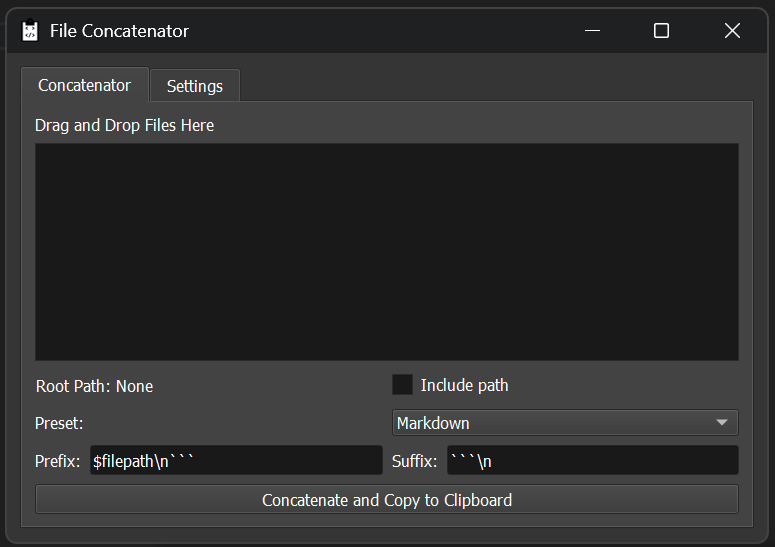

# Code2Clip File Concatenator


**Code2Clip** is a simple desktop application for quickly concatenating file contents and copying the result to the clipboard.

### Key Features:
- **Drag and Drop**: Add files by dragging them into the application window.
- **Reorder**: Change the order of concatenation by dragging files in the list.
- **Filter File Types**: Choose between curated extension categories (Text, Code, Data) or allow everything.
- **Wrap**: Wrap file contents with **XML**, **Markdown**, or **custom** tags based on their filenames.
- **Copy to Clipboard**: Instantly copies the concatenated result to your clipboard.
- **Remote File Support (SSH)**: Pull files directly from a remote machine over SSH.
- **File Encoding & Metadata**: Inspect file encodings and metadata via a right-click context menu.
- **WSL2 Path Support**: Automatically converts WSL2 paths to Windows-compatible paths.



---

## Why Use Code2Clip?

Quickly combine and format files for use in AI models like ChatGPT, DeepSeek, and Claude — without tedious copying. The file contents are re-read every time you copy to clipboard.

---

## Usage

Run the application using:

```bash
python code2clip.py
```

### **How to Use:**
1. **Drag and drop files** into the main window. You can also paste contents of your clipboard from the right-click menu.
2. **Reorder files** by dragging them in the list.
3. **Right-click** on a file for options:
   - Remove the file
   - Check its encoding
   - View metadata (size, modification date)
4. **Pick the file filter mode** under *Settings → File Types* to control which extensions are accepted.
5. **Connect to SSH** (optional) by entering a host and username under *Settings → SSH* — remote paths copied from the clipboard are fetched automatically.
6. **Select a preset** (XML, Markdown, or Custom) to define how files are wrapped.
7. **Click "Concatenate and Copy to Clipboard"**.
8. **Paste the result** into your desired application.

---

## Example Output

For files `file1.txt` and `file2.txt`:

**file1.txt**:
```
Hello World
```

**file2.txt**:
```
Goodbye World
```

With **XML Preset**, the output will be:

```xml
<file filename="file1.txt">
Hello World
</file>
<file filename="file2.txt">
Goodbye World
</file>
```

This text is **automatically copied** to your clipboard.

---

## Filtering File Types

Version **1.4.0** introduces configurable file filters. Open the **Settings** tab and choose which categories you would like to
include (Text, Code, or Data). The file list will immediately honour your selection so accidental binary files stay out of the
clipboard bundle.

If you need to work with every extension, toggle **Allow all extensions** instead. The selection persists between sessions via
`QSettings`.

---

## Working with SSH Sources

Code2Clip can fetch files from a remote Linux or macOS host. Enter your host and username under **Settings → SSH** and click
**Connect**. When you copy a remote path into the clipboard, Code2Clip detects it and downloads the contents over SFTP. Authent
ication retries prompt for a password when required, and the connection is cached for the session.

---

## Mac OS binaries (release)

To run the `.app` downloaded from a GitHub release:

Unzip the app
```bash
unzip Code2Clip-macos.zip
```
Move it somewhere convenient (e.g., Applications folder)
```bash
mv Code2Clip.app /Applications
```
Remove macOS quarantine flag
```bash
xattr -d com.apple.quarantine /Applications/Code2Clip.app
```
(Optional) Run from the terminal for debug logs
```bash
open /Applications/Code2Clip.app
```
If macOS complains that the app is “damaged” or “not trusted”, it’s because the app is unsigned. You can always run it via:
```bash
chmod +x /Applications/Code2Clip.app/Contents/MacOS/code2clip
/Applications/Code2Clip.app/Contents/MacOS/code2clip
```

---

## Installation from Source

### **Prerequisites**
- **Python 3.8+** – Download from [python.org](https://www.python.org/downloads/)
- **Pip** (comes with Python)
- **PyQt5** (GUI framework)
- **Paramiko** (SSH support)

### **Clone and Install Dependencies**
It's recommended to use a virtual environment:

```bash
# Clone the repository
git clone https://github.com/yourusername/code2clip.git
cd code2clip

# Install dependencies in a virtual environment
python -m venv venv
source venv/bin/activate  # On Windows, use `venv\Scripts\activate`
pip install -r requirements.txt
```

---

## Packaging as an Executable

To distribute the app **without requiring Python**, create a standalone executable using **PyInstaller**:

1. **Install PyInstaller**:
   ```bash
   pip install pyinstaller
   ```

2. **Build the Executable**:
   ```bash
   pyinstaller --onefile --windowed code2clip.py
   ```

3. The executable will be located in the `dist` folder.

---

## Contributing

Contributions are welcome! To report bugs, suggest features, or submit pull requests, please check out the [CONTRIBUTING.md](CONTRIBUTING.md).

---

## License

This project is licensed under the [MIT License](LICENSE).

---

## Acknowledgements

- [PyQt5](https://www.riverbankcomputing.com/software/pyqt/intro/) – GUI framework
- [chardet](https://github.com/chardet/chardet) – Encoding detection library

---
